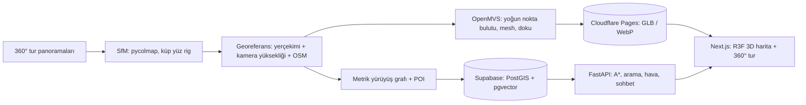

# Aydın Campus Map

[](https://github.com/Yigtwxx/aydin-university-map/actions/workflows/ci.yml)
[](LICENSE)

**TR** · İstanbul Aydın Üniversitesi Florya kampüsünün 3D haritası. Model, üniversitenin
360° sanal turundaki panoramalardan fotogrametriyle çıkarılıyor. Üstüne gerçek metre
cinsinden bir yürüyüş grafı kuruluyor ve en kısa yürüme rotaları hesaplanıyor.

**EN** · A 3D map of İstanbul Aydın University's Florya campus, reconstructed with
photogrammetry from the panoramas of the university's 360° virtual tour, with a metric
walking graph and shortest walking routes.

> **Durum / Status:** Faz 1: SfM spike tamamlandı ([ADR-0003](docs/adr/0003-sfm-spike.md)). Phase 1: SfM spike done.

---

## Türkçe

### Ne yapacak?

- **Turdan 3D kampüs:** panoramalardan kamera konumları (SfM) ve dokulu 3D model.
  Varsayılan görünüm stilize bina modeli, istenirse foto-gerçekçi görünüme geçilebilir.
- **En kısa yürüyüş yolu:** turdaki gerçek yürünebilir bağlantılar, metre cinsinden
  ağırlıklar, A\* ile rota. "Merdivensiz rota" seçeneği de var.
- **Adım adım 360° tarif:** rotayı panoramalar üzerinde yürüyerek takip etme. Oklar
  doğru yönü gösterir.
- **Canlı ortam:** güneşin gerçek konumu ve o anki hava durumuna göre gündüz, gün batımı,
  gece, yağmur ve sis.
- **Yapay zekâ asistanı:** "Kütüphaneden T Blok'a nasıl giderim?" gibi sorulara rota ve
  yer işaretleriyle cevap (RAG + tool calling, ücretsiz API'ler).
- **Sinematik giriş:** scroll'la gökyüzünden kampüse, oradan bir panoramaya dalış.

### Nasıl çalışıyor?



Tasarımın tamamı: [`docs/superpowers/specs/2026-10-06-campus-map-design.md`](docs/superpowers/specs/2026-10-06-campus-map-design.md)

### Yol haritası

| Faz | İçerik | Durum |
|---|---|---|
| 0 | Repo, araçlar, CI, tur metadata modülü | ✅ |
| 1 | Spike: panoramaları dışa aktarma, rig testi, 35 panoramada SfM | ✅ |
| 2 | Tüm Florya: georeferans, 3D modeller, yürüyüş grafı | 🚧 |
| 3 | FastAPI: rota, arama, hava durumu | ⏳ |
| 4 | Web: 3D harita, rota, 360° tur, canlı ortam | ⏳ |
| 5 | Yapay zekâ asistanı (RAG) | ⏳ |
| 6 | Giriş animasyonu, performans, yayına alma | ⏳ |
| 7 | İç mekân navigasyonu, fotoğrafla konum bulma | ⏳ |

### Geliştirme

```bash
uv sync --all-packages        # Python 3.12 ortamı (uv kurar)
uv run pytest                 # testler (sentetik veriyle)
uv run amap tour build        # tur metadata'sını sınıflandır (yerel veri gerekir)
```

Ayrıntılar için [CONTRIBUTING.md](CONTRIBUTING.md).

### Veri politikası

Kod MIT lisanslı, **veri değil**. Tur panoramaları ve onlardan türetilen her şey
üniversiteye ve tur sağlayıcısına aittir. İzinle kullanılır ve bu repoya asla girmez.
Bkz. [docs/data-policy.md](docs/data-policy.md).

---

## English

### Features (planned)

- **3D campus from the tour:** camera poses via SfM and textured meshes from the
  panoramas. A stylized massing view is the default, with a photoreal toggle.
- **Shortest walking routes:** the tour's real walkable links, metric edge weights,
  A\* routing, and an avoid-stairs option.
- **Step-by-step 360° directions:** walk the route through the panoramas, with arrows
  that point the right way.
- **Live environment:** real sun position and current weather (day, sunset, night,
  rain, fog).
- **AI assistant:** answers questions like "How do I get from the library to T Blok?"
  with routes and landmarks (RAG + tool calling, free API tiers).
- **Cinematic landing:** a scroll-driven dive from the sky onto the campus and into a
  panorama.

### Stack

Python 3.12 (uv, pycolmap, OpenMVS as an external tool, Open3D, osmnx, FastAPI,
NetworkX, pydantic-ai) · Next.js 16 + TypeScript (React Three Fiber, Photo Sphere
Viewer, GSAP, Tailwind, next-intl) · Supabase (PostGIS, pgvector) · Cloudflare Pages.

### Development

```bash
uv sync --all-packages
uv run ruff check . && uv run pyright && uv run pytest
```

See [CONTRIBUTING.md](CONTRIBUTING.md), [SECURITY.md](SECURITY.md) and the
[Code of Conduct](CODE_OF_CONDUCT.md).

### Data policy

The code is MIT-licensed; **the data is not**. Tour panoramas and everything derived
from them belong to the university and the tour vendor. They are used with permission
and never committed. See [docs/data-policy.md](docs/data-policy.md).

## License & attribution

- Code: [MIT](LICENSE) © 2026 Yiğit Erdoğan. Independent project, not an official university product.
- 360° görüntüler / 360° imagery: İstanbul Aydın Üniversitesi sanal turu, used with permission
- Map data © [OpenStreetMap](https://www.openstreetmap.org/copyright) contributors (ODbL)
- Weather data by [Open-Meteo](https://open-meteo.com/) (CC BY 4.0)
