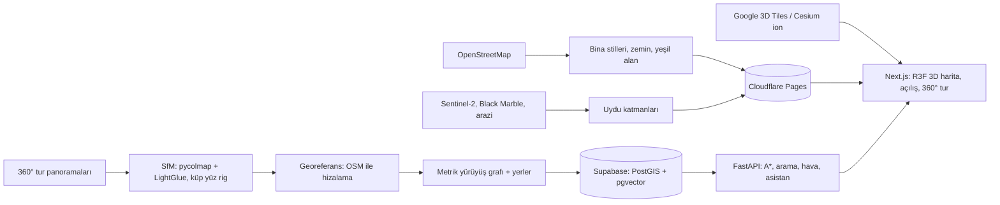

# Aydın Campus Map

[](https://github.com/Yigtwxx/aydin-university-map/actions/workflows/ci.yml)
[](LICENSE)

**TR** · İstanbul Aydın Üniversitesi Florya kampüsünün 3D haritası. Model, üniversitenin
360° sanal turundaki panoramalardan fotogrametriyle çıkarılıyor. Üstüne gerçek metre
cinsinden bir yürüyüş grafı kuruluyor ve en kısa yürüme rotaları hesaplanıyor.

**EN** · A 3D map of İstanbul Aydın University's Florya campus, reconstructed with
photogrammetry from the panoramas of the university's 360° virtual tour, with a metric
walking graph and shortest walking routes.

> **Canlı / Live:** [aydin-campus-map.vercel.app](https://aydin-campus-map.vercel.app) ·
> API: [aydin-campus-api.vercel.app/docs](https://aydin-campus-api.vercel.app/docs)
>
> **Durum / Status:** Faz 0–6 yayında; yoğun mesh (Faz 7a) sürüyor. Phases 0–6 are live;
> the dense mesh (phase 7a) is in progress.

---

## Türkçe

### Neler var?

- **Yükselen kampüs:** açılışta kamera düz haritanın tam üstünden eğilirken binalar
  kampüsten dışa doğru bir dalgayla zeminden yükselir; ardından canlı harita gelir.
  Oturum başına bir kez oynar, bir dokunuşla hızlanır. (İstanbul üstünden kaydırmalı
  dalışın kodu, önceden render edilmiş bir sürüm için saklanıyor.)
- **Kampüs ve çevresi 3D:** 3.000'i aşkın bina türüne göre çizilir: kiremit veya parapetli
  çatı, çekme kat, dükkân vitrini, kubbe ve minare, hangar. İstenirse tek tuşla
  fotogerçekçi görünüme geçilir.
- **En kısa yürüyüş yolu:** 360° turdan çıkarılan metrik yürüyüş grafı ve A\* rotası.
  Rotalar binaların içinden geçmez; "merdivensiz rota" seçeneği de var.
- **Bina içi rota:** 190'dan fazla oda ve laboratuvar aranabilir ("Anatomi Lab"); rota
  binaya girer, merdivenle kaç kat inileceğini söyler ve odada biter. Bina içi mesafeler
  sanal turun bağlantılarından tahmin edilir ve öyle belirtilir.
- **Adım adım 360° tarif:** her adımın panoraması, doğru yöne bakan önizleme.
- **Canlı ortam:** güneşin gerçek konumu ve anlık hava durumu (gündüz, gün batımı, gece,
  yağmur, sis).
- **Yapay zekâ asistanı:** "E Blok'a nasıl giderim?" gibi sorulara rota çizerek ve
  kampüs bilgisinden alıntı yaparak cevap verir (RAG + tool calling, ücretsiz API'ler).
- **Mobil ve paylaşım:** sürüklenebilir alt panel, paylaşılabilir rota bağlantıları.

### Nasıl çalışıyor?



Tasarımın tamamı: [`docs/superpowers/specs/2026-10-06-campus-map-design.md`](docs/superpowers/specs/2026-10-06-campus-map-design.md)

### Yol haritası

| Faz | İçerik | Durum |
|---|---|---|
| 0 | Repo, araçlar, CI, tur metadata modülü | ✅ |
| 1 | Spike: panoramaları dışa aktarma, rig testi, 35 panoramada SfM | ✅ |
| 2 | Tüm Florya: SfM (80/96 dış mekân), georeferans, yürüyüş grafı | ✅ |
| 3 | FastAPI + Supabase: rota, arama, hava durumu | ✅ |
| 4 | Web: 3D harita, rota, 360° tur, canlı ortam, mobil | ✅ |
| 5 | Yapay zekâ asistanı (RAG) | ✅ |
| 6 | Açılış animasyonu, yayına alma, E2E | ✅ |
| 7 | Yoğun dokulu mesh, bina içi rota | ✅ |

### Geliştirme

```bash
./start.sh                    # API (:8000) + web (:3000) birlikte, Ctrl+C ile durur
uv run pytest                 # Python testleri (sentetik veriyle)
pnpm --filter web test        # web testleri
uv run amap --help            # pipeline komutları (yerel tur verisi gerekir)
```

Ayrıntılar için [CONTRIBUTING.md](CONTRIBUTING.md).

### Veri politikası

Kod MIT lisanslı, **veri değil**. Tur panoramaları ve onlardan türetilen her şey
üniversiteye ve tur sağlayıcısına aittir. İzinle kullanılır ve bu repoya asla girmez.
Bkz. [docs/data-policy.md](docs/data-policy.md).

---

## English

### Features

- **A rising campus:** the map opens looking straight down on the flat map; as the
  camera tilts, the buildings rise out of the ground in a wave from the campus outwards,
  then the live map takes over. It plays once per session and speeds up on any touch.
  (The scroll dive over İstanbul stays in the code for a pre-rendered version.)
- **The campus and its neighbourhood in 3D:** 3,000+ buildings drawn by type (tiled or
  parapet roofs, set-back floors, shop fronts, domes and minarets, hangars), with a
  one-tap photorealistic view.
- **Shortest walking routes:** a metric walking graph built from the 360° tour, A\*
  routing that never cuts through buildings, and an avoid-stairs option.
- **Indoor routes:** 190+ rooms and labs are searchable ("Anatomi Lab"); the route enters
  the building, says how many floors to climb and ends in the room. Indoor distances are
  estimated from the tour's links and marked as such.
- **Step-by-step 360° directions:** each step's panorama, facing the way you walk.
- **Live environment:** the real sun position and current weather.
- **AI assistant:** answers "How do I get to E Blok?" by drawing the route and quoting
  campus knowledge (RAG + tool calling on free API tiers).
- **Mobile and sharing:** a draggable bottom sheet and shareable route links.

### Stack

Python 3.12 (uv, pycolmap, kornia LightGlue, OpenMVS as an external tool, shapely,
FastAPI, NetworkX, pydantic-ai) · Next.js 16 + TypeScript (React Three Fiber,
3d-tiles-renderer, Photo Sphere Viewer, Lenis, motion, Tailwind, next-intl, Playwright) ·
Supabase (PostGIS, pgvector) · Cloudflare Pages (assets) · Vercel (web + API).

### Development

```bash
./start.sh                    # API on :8000 and web on :3000 (Ctrl+C stops both)
uv run ruff check . && uv run pyright && uv run pytest
pnpm lint && pnpm typecheck && pnpm test
```

See [CONTRIBUTING.md](CONTRIBUTING.md), [SECURITY.md](SECURITY.md) and the
[Code of Conduct](CODE_OF_CONDUCT.md).

### Data policy

The code is MIT-licensed; **the data is not**. Tour panoramas and everything derived
from them belong to the university and the tour vendor. They are used with permission
and never committed. See [docs/data-policy.md](docs/data-policy.md).

## License & attribution

- Code: [MIT](LICENSE) © 2026 Yiğit Erdoğan. Independent project, not an official university product.
- 360° görüntüler / 360° imagery: İstanbul Aydın Üniversitesi sanal turu, used with permission
- Photorealistic 3D city: Google Photorealistic 3D Tiles, streamed through [Cesium ion](https://cesium.com/platform/cesium-ion/) (credits shown on screen)
- Satellite imagery: [EOxCloudless](https://cloudless.eox.at) by EOX IT Services GmbH (contains modified Copernicus Sentinel data 2024; CC BY-NC-SA 4.0)
- Night lights: NASA Earth Observatory / GIBS, VIIRS Black Marble
- Terrain: [Terrain Tiles](https://github.com/tilezen/joerd/blob/master/docs/attribution.md) by Mapzen/Tilezen (SRTM, GMTED2010, 3DEP, ETOPO1, EU-DEM and others)
- Map data © [OpenStreetMap](https://www.openstreetmap.org/copyright) contributors (ODbL)
- Weather data by [Open-Meteo](https://open-meteo.com/) (CC BY 4.0)
